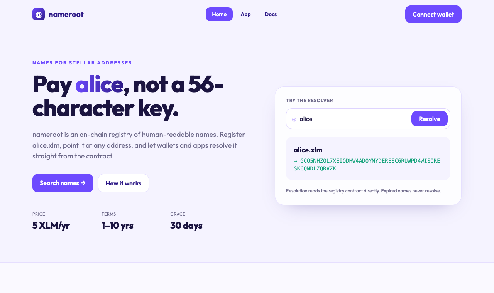
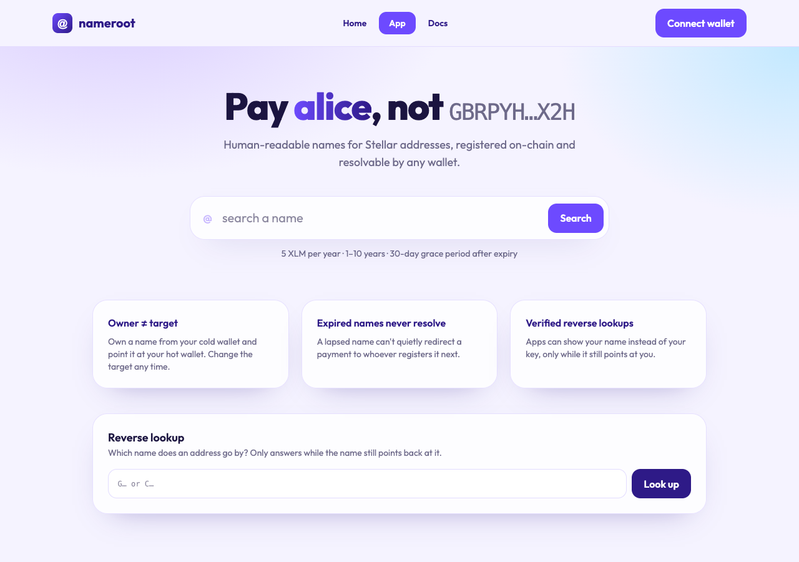

# Nameroot

**Human-readable names for Stellar addresses. Pay `alice`, not `GBRPYHIL2C…`.**

Nameroot is a Soroban name registry. Register a name once, point it at
any address, and wallets, dApps and payment links can resolve it
on-chain. Copy-paste mistakes with 56-character keys are one of the
most common ways funds get lost; names fix that.

```text
alice      →  GBRPYHIL2CI3FNQ4BXLFMNDLFJUNPU2HY3ZMFSHONUCEOASW7QC7OX2H
acme-shop  →  GA5ZSEJYB37JRC5AVCIA5MOP4RHTM335X2KGX3IHOJAPP5RE34K4KZVN
```

## Design

- **Owner vs target.** The owner controls the name; the target is where
  it resolves. A cold wallet can own a name that points at a hot wallet.
- **Leased by the year** (1–10 years, capped at 10 years ahead), paid in
  a configurable token to a treasury. That makes squatting cost money
  and lets abandoned names return to the pool. Anyone can pay to renew a
  name, but renewing never changes its owner.
- **Expired names never resolve.** A lapsed name can't silently send
  someone's payment to a new owner.
- **30-day grace period** after expiry, during which only a renewal is
  possible; nobody else can register the name.
- **Safe reverse lookups.** `primary_name(address)` only answers while
  that name is active *and* still points at the address. Retargeting or
  letting it expire clears it automatically, so a reverse record can't
  go stale or be spoofed.
- **One canonical spelling.** Names are 3–32 characters of `a–z`, `0–9`
  and inner hyphens, lowercase only, so `Alice` and `alice` can't be two
  different names, and non-ASCII look-alikes are rejected.

## Contract interface

| Function | Who signs | Notes |
| --- | --- | --- |
| constructor `(admin, fee_token, price_per_year, treasury)` | — | Runs at deployment, so the registry is never left unconfigured |
| `register(owner, name, target, years)` | owner | Pays `price_for(name, years)` |
| `renew(payer, name, years)` | payer | Works until the end of the grace period |
| `set_target(name, target)` | owner | Active names only |
| `transfer(name, new_owner)` | owner | Active names only; the name then points at `new_owner` |
| `set_primary(address, name)` | address | The name must resolve to `address` |
| `clear_primary(address)` | address | Removes the reverse record |
| `resolve(name)` | anyone | Fails if expired |
| `primary_name(address)` | anyone | `None` unless still valid |
| `is_available(name)`, `get_record(name)`, `settings()`, `price_for(name, years)`, `length_pricing()` | anyone | Read state |
| `set_price(price_per_year)` | admin | Emits `PriceChanged` |
| `set_length_pricing(three, four)` | admin | Price multipliers for 3- and 4-character names |
| `set_treasury(treasury)` | admin | Where fees go |
| `set_admin(new_admin)` | admin **and** new admin | Both sign, so a typo can't lock the registry |

Errors: `AlreadyInitialized (1)`, `NotInitialized (2)`, `InvalidName (3)`,
`NameTaken (4)`, `NameNotFound (5)`, `NameExpired (6)`, `InvalidYears (7)`,
`NotOwner (8)`, `InvalidPrice (9)`, `PrimaryMismatch (10)`.

Events: `("name","registered", name)`, `("name","renewed", name)`,
`("name","updated", name)`, `("name","price")`, `("name","admin")`,
`("name","treasury")`, `("name","unprimary")`.

## Build, test and deploy

```bash
cd contracts
cargo test        # 18 unit tests
stellar contract build
# settings are constructor arguments: deploy and configure in one step
stellar contract deploy --wasm target/wasm32v1-none/release/nameroot.wasm \
  --source me --network testnet -- \
  --admin me --fee_token <XLM_SAC_ID> --price_per_year 50000000 --treasury me

stellar contract invoke --id <NAMEROOT> --source alice --network testnet -- \
  register --owner alice --name alice --target alice --years 1
stellar contract invoke --id <NAMEROOT> --network testnet -- resolve --name alice
```

## Web app



The site has three pages: **Home** (what it does, with live testnet data), **App** (the tool itself) and **Docs** (getting started, concepts, reference and FAQ).



A registrar-style app at `web/`:

- **Search** any name: see whether it's available, registered or in its 30-day grace period, where it resolves, who owns it and when it expires.
- **Register** for 1–10 years at the on-chain price, pointing at your wallet or any other address.
- **Manage** as owner: renew, point the name at a new target, transfer ownership, or make it your primary name (the header then shows `you.xlm`).
- **Reverse lookup**: which name an address goes by, answered only while the name still points back.

```bash
cd web
npm install
npm run dev        # http://localhost:5173
```

It talks to the contract deployed on **Stellar testnet** and signs with
[Freighter](https://www.freighter.app) (switch it to Testnet). Point it at
another deployment with `VITE_CONTRACT_ID` (see `web/.env.example`).
`netlify.toml` at the repo root deploys it as-is.

## Documentation

- [Architecture](docs/architecture.md)
- [Testnet deployment](docs/deployment.md)
- [Resolving names](docs/resolving-names.md)
- [Contributing](CONTRIBUTING.md) · [Security policy](SECURITY.md) · [Changelog](CHANGELOG.md)

## Glossary (new to Stellar?)

- **Name registry**: a contract mapping names to addresses, like DNS for
  wallets.
- **Resolve**: look up the address a name currently points to.
- **Reverse lookup / primary name**: the opposite direction, i.e. which
  name an address goes by, so apps can show "alice" instead of a key.
- **Grace period**: time after expiry when only the previous owner can
  get the name back by renewing.
- **Soroban / SAC**: Stellar's smart-contract platform / the contract
  address representing a Stellar asset, used here to pay fees.

## License

MIT
